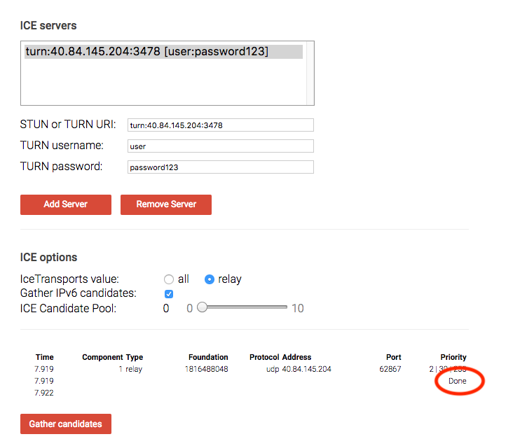

If you have worked with [WebRTC](https://webrtc.org/) you might have come across TURN Server.
### What is TURN Server?
The term means Traversal Using NAT(TURN), well it's getting more complicated.

[NAT](https://en.wikipedia.org/wiki/Network_address_translation)(Network Address Traversal) is a protocol that assists in the traversal of network address translators or firewalls for multimedia applications.

In WebRTC applications communicating across different networks, a TURN server is required for relaying traffic between peers.

TURN server works together with STUN (Session Traversal of User Datagram Protocol [UDP] Through Network Address Translators [NATs]) server which is used to get external network addresses. STUN servers can be available for [free](https://gist.github.com/zziuni/3741933) but maintaining TURN server is resource-intensive. The good news is there are open-source implementation that can be self-hosted.

> Most TURN server supports STUN server functionalities.

### Deploying TURN server
Most people recommend [Coturn](https://github.com/coturn/coturn), an open-source and fully spec-compliant TURN server.

__Coturn Feature__

- Supports STUN server functionality
- Compliant with base TURN and STUN specs RFC 5766, RFC 3489, RFC 5389, RFC 6062
- Free and open source
- Can be easily set up on the Linux platform
- Works over both TCP and UDP protocols

To deploy coturn in production you will require a server(VPS) provider service. ie Digital Ocean, AWS or Linode

Connect to your virtual machine with SSH and run the following command

```sh
sudo apt-get update
sudo apt-get install -y dnsutils
sudo apt-get install -y coturn
sudo rm -rf /var/lib/apt/lists/*
```
Next, we created a file with the script listed below. It prints configuration information to /etc/turnserver.conf , such as listening, relay, and external IPs and a reference to a self-signed certificate. It also adds credentials to the SQLite database that is running on the same server using the turnadmin command.

```sh
internalIp="$(ip a | grep -Eo 'inet (addr:)?([0-9]*\.){3}[0-9]*' | grep -Eo '([0-9]*\.){3}[0-9]*' | grep -v '127.0.0.1')"
externalIp="$(dig +short myip.opendns.com @resolver1.opendns.com)"

echo "listening-port=3478
tls-listening-port=5349
listening-ip="$internalIp"
relay-ip="$internalIp"
external-ip="$externalIp"
realm=$3
server-name=$3
cli-password=$2
lt-cred-mech
userdb=/var/lib/turn/turndb
# use real-valid certificate/privatekey files
cert=/etc/ssl/turn_server_cert.pem
pkey=/etc/ssl/turn_server_pkey.pem

no-stdout-log"  | tee /etc/turnserver.conf


turnadmin -a -u $1 -p $2 -r $3

turnserver -o
```

The script requires 3 parameters (username, password, and realm) that will be sent as authentication data to the TURN server. Running the script will start the TURN server and output server URLs.

```
sudo bash deploy.sh user password somerealm.com
```

> The server will be started in background `turnserver -o`

You can use WebRTC [Trickle ICE page](https://webrtc.github.io/samples/src/content/peerconnection/trickle-ice/) to validate if it works.



### Docker Container
There is also a docker Container which makes it simple to deploy and reusable. Find the image in [docker hub](https://hub.docker.com/r/zolochevska/turn-server/).
With this setup, we can run the Docker container on any Unix VM with Docker installed:

```sh
sudo docker run -d -p 3478:3478 -p 3478:3478/udp --restart=always zolochevska/turn-server username password realm
```
